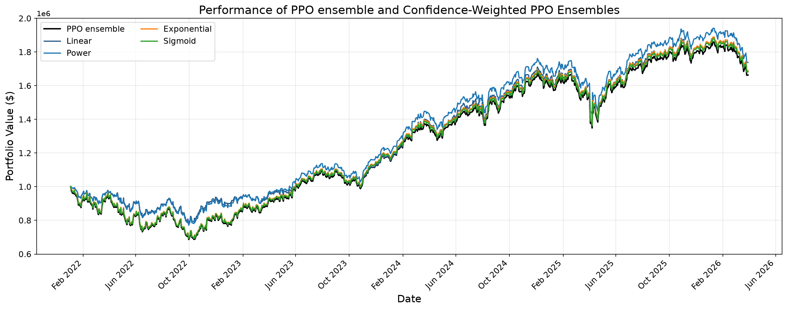
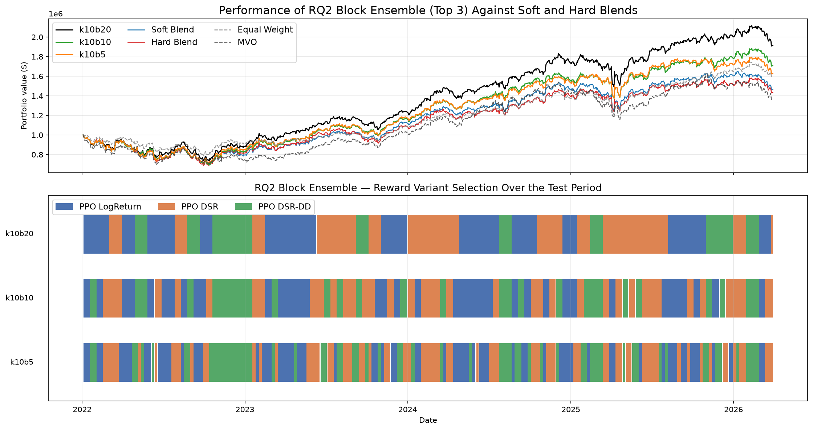
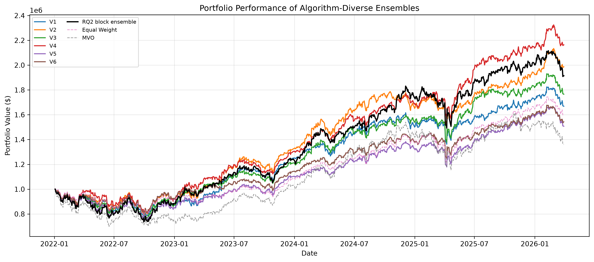

# Ensemble Deep RL for Portfolio Allocation

Daily portfolio allocation over the 30 Dow Jones Industrial Average constituents
(plus cash), learned with deep reinforcement learning. The project asks a single
question in three parts: **when you build an ensemble of DRL agents, where should
the diversity between members come from, and how should their proposals be
combined?**

Three sources of diversity are tested — random seed, training objective, and the
learning algorithm itself — each as its own experiment, with a shared
environment, dataset, and evaluation protocol so the comparisons are clean. Every
strategy is measured against two transaction-cost-aware baselines: an
equal-weight buy-and-hold portfolio and a mean–variance optimised (MVO)
portfolio.

This is the code behind a Master's dissertation, which carries the full
derivations and literature review. This README covers what the code does and how
to run it.

## Research questions

**RQ1 — Is disagreement between agents a usable signal?**
Five PPO agents differing only in random seed will still propose different
allocations on any given day. That spread is a measure of epistemic uncertainty.
Can it be used to scale the ensemble's risk-taking day to day — leaning on the
ensemble's proposal when the members agree, and holding the existing position
when they don't?

**RQ2 — Does diversity in the training objective help?**
With architecture, data, and environment held fixed, three PPO agents are trained
on three different reward functions (log return, differential Sharpe ratio, and a
drawdown-penalised DSR). Does combining them beat any one objective used alone?

**RQ3 — Does algorithm diversity add anything on top of that?**
The RQ2 machinery is generalised to mix PPO, SAC, and A2C. Does a second,
independent axis of diversity make the ensemble more robust than reward diversity
alone?

The three build on each other: RQ1 isolates disagreement as a signal, RQ2
diversifies the objective, and RQ3 adds the algorithm.

## Results

Out-of-sample over 2022-01-01 → 2026-03-31 (1,063 trading days), a window
spanning the 2022 bear market and the subsequent recovery. Sharpe is annualised
with a zero risk-free rate.

**RQ1 — seed disagreement.** Averaging five seeds beats a single PPO agent given
the same total compute (5 × 1M vs 1 × 5M timesteps). The confidence mappings
then improve on the ensemble, mostly by cutting drawdown.

| Strategy | Cum. return | Sharpe | Max drawdown |
| --- | ---: | ---: | ---: |
| Single PPO (5M steps) | 52.4% | 0.55 | −34.3% |
| PPO ensemble (5 × 1M) | 66.3% | 0.70 | −31.4% |
| + power mapping | **73.9%** | **0.84** | −23.1% |
| + linear mapping | 68.8% | 0.81 | −22.1% |
| Equal weight | 59.6% | 0.81 | **−21.7%** |
| MVO | 35.9% | 0.45 | −30.0% |

One caveat on that result: measured disagreement varies over a narrow range
relative to the calibrated reference scale, so the linear and power mappings end
up assigning the ensemble proposal very little weight on most days. Their gain is
consistent with heavily smoothing the ensemble's positioning at low turnover
rather than with genuine day-to-day risk modulation.



**RQ2 — reward diversity.** The three reward variants do produce distinct risk
profiles, but naive soft or hard blending does not exploit that. Constraining how
often the selected member can change is what makes the difference.

| Strategy | Cum. return | Sharpe | Max drawdown |
| --- | ---: | ---: | ---: |
| `log_return` member | 38.2% | 0.50 | −27.0% |
| `dsr` member | 50.2% | 0.55 | −33.7% |
| `dsr_drawdown` member | 46.7% | 0.60 | −29.2% |
| Soft blend | 46.7% | 0.57 | −29.8% |
| Hard blend | 43.4% | 0.53 | −31.4% |
| Block selector (k=10, 20-day block) | **91.5%** | **0.88** | −26.3% |



**RQ3 — algorithm diversity.** All six reward×algorithm permutations have
shallower drawdowns than the RQ2 ensemble, and three of them also beat its
Sharpe. V4 is the strongest overall.

| Version | PPO / SAC / A2C reward | Cum. return | Sharpe | Max drawdown |
| --- | --- | ---: | ---: | ---: |
| V1 | log / dsr / dsr-dd | 66.9% | 0.83 | −22.1% |
| V2 | log / dsr-dd / dsr | 98.7% | 1.12 | −20.5% |
| V3 | dsr / log / dsr-dd | 76.6% | 0.90 | −24.1% |
| V4 | dsr / dsr-dd / log | **116.4%** | **1.23** | **−18.9%** |
| V5 | dsr-dd / log / dsr | 50.8% | 0.69 | −24.9% |
| V6 | dsr-dd / dsr / log | 54.3% | 0.77 | −19.8% |
| RQ2 block ensemble | — | 91.5% | 0.88 | −26.3% |

Algorithm diversity improves risk characteristics consistently, but how the
rewards are assigned across algorithms still matters a great deal — it is not a
free win from mixing algorithms alone.



All eight result plots are in [`figures/`](figures). The plot steps below
regenerate them into `results/rq1`, `results/rq2` and `results/rq3`; the copies
committed here are the versions used in the dissertation.

## How it works

**Data.** Daily adjusted prices for the 30 DJIA constituents from Yahoo Finance
(2010-01-01 → 2026-03-31), plus VIX and the DJIA index used only for feature
construction. Five features per ticker-day: the per-ticker log return, 20-day and
60-day annualised realised volatility of the index, their ratio, and the VIX
level. All features are trailing-only, so no look-ahead. Train is 2010–2021; test
is 2022 onward, with 60 lead-in days saved ahead of the first trade date so the
observation window is populated without leaking test data into training.

**Environment.** One Gymnasium environment shared by every experiment
(`PortfolioAllocationEnv`). The observation is a 31×64 array — current weights,
60 days of trailing log returns per asset, and three market features broadcast
across rows. The action is a non-negative 31-vector normalised to the simplex,
i.e. target portfolio weights including cash. Each step rebalances instantly at
the close, charges a proportional 0.1% fee on L1 turnover, then applies the next
day's returns. No shorting, no leverage, full liquidity assumed.

**Rewards.** Three objectives, all computed from the net growth factor after
fees: log return (growth-optimal, risk-neutral), differential Sharpe ratio (an
online per-step approximation to the change in Sharpe), and DSR minus a squared
penalty on *increases* in drawdown. The DSR-family rewards are calibrated to
match log return's typical magnitude so the three signals are on comparable
scales — and re-calibrated per algorithm in RQ3, since different algorithms
produce different return distributions.

**Ensembling.** RQ1 measures disagreement as the mean total-variation distance of
the five proposals from their element-wise mean, maps it to a confidence score
through one of four functions, and blends the ensemble mean toward a safe
allocation (the previous day's weights). RQ2 and RQ3 instead score each member by
its own trailing k-day Sharpe — computed in a per-member tracking environment, so
a member is judged on its own decisions rather than the blend's — and combine via
soft (smoothed softmax), hard (winner-takes-all daily), or block (winner held for
a fixed number of days) selection.

## Layout

```
src/rl_portfolio/                 # core library, shared by all experiments
  config.py                       # dates, directories, TIME_WINDOW
  tickers.py                      # DOW_30_TICKER
  envs/portfolio_allocation_env.py
  agents/
    portfolio_allocation_agent.py           # SB3 wrapper (PPO/A2C/SAC)
    portfolio_allocation_ensemble_agent.py  # RQ2 trailing-performance blend
    cross_model_ensemble_agent.py           # RQ3 heterogeneous blend
  utils/                          # simplex projection, io, TB callback, backtest stats

figures/                          # result plots, as used in the dissertation

pipelines/                        # runnable experiment steps
  data/                           # download, features, validation, train/test split
  baselines/                      # equal-weight and MVO, computed once
  rq1/                            # 5×PPO, disagreement → confidence → safe blend
  rq2/                            # three rewards + trailing selector
  rq3/                            # PPO/SAC/A2C × rewards, versions v1–v6
```

Generated data, models, and results are gitignored — regenerate them with the
pipelines below.

## Setup

```bash
pip install -r requirements.txt
pip install -e . --no-deps
```

Python 3.9+. Training uses Stable-Baselines3 on PyTorch; a GPU helps but is not
required.

## Running

All commands run from the repo root. Once the package is installed as above,
direct execution (`python pipelines/rq1/rq1_train.py`) works too.

**Shared setup** — run once, everything else depends on it:

```bash
python -m pipelines.data.portfolio_allocation_data   # -> data/portfolio_allocation_{train,test}.pkl
python -m pipelines.baselines.compute_baselines      # -> results/baselines/
```

**RQ1** — trains five seeded PPO agents (1M steps each) plus a compute-matched
5M single-agent control, calibrates the disagreement reference scale on
2019–2021, then evaluates every confidence-mapping × safe-strategy combination:

```bash
python -m pipelines.rq1.rq1_train
python -m pipelines.rq1.rq1_validate
python -m pipelines.rq1.rq1_test
python -m pipelines.rq1.rq1_backtest
```

**RQ2** — trains all three reward variants, calibrates the DSR scaling against
the log-return policy, evaluates members individually and as an ensemble, then
sweeps the selector's trailing window against its block tenure:

```bash
python -m pipelines.rq2.rq2_train
python -m pipelines.rq2.rq2_calibrate
python -m pipelines.rq2.rq2_test_members
python -m pipelines.rq2.rq2_ensemble
python -m pipelines.rq2.rq2_sweep
python -m pipelines.rq2.rq2_backtest
```

**RQ3** — reuses the RQ2 PPO members (copy them into `rq_trained_models/rq3/`)
and trains SAC and A2C afresh. Train each algorithm's `log_return` member first,
since calibration steps those policies to anchor the per-algorithm DSR scaling,
then train the DSR pair and the drawdown pair:

```bash
python -m pipelines.rq3.rq3_train --algo sac --reward-type log_return
python -m pipelines.rq3.rq3_train --algo a2c --reward-type log_return
python -m pipelines.rq3.rq3_calibrate
python -m pipelines.rq3.rq3_train --algo sac --reward-type dsr
python -m pipelines.rq3.rq3_train --algo a2c --reward-type dsr
python -m pipelines.rq3.rq3_train --algo sac --reward-type dsr_drawdown
python -m pipelines.rq3.rq3_train --algo a2c --reward-type dsr_drawdown
python -m pipelines.rq3.rq3_block_suite
python -m pipelines.rq3.rq3_sweep
python -m pipelines.rq3.rq3_backtest
```

Training steps accept `--tag smoke --total-timesteps 60000` for a fast
end-to-end check before committing to a full run.

The remaining scripts in each folder (`rq1_beta_*`, `rq1_power_*`,
`rq1_confidence_grid`, `rq2_plot_selection`, `rq3_underwater`,
`rq3_risk_return_scatter`, and so on) are figure and ablation generators. They
read results already written by the steps above and can be run in any order
afterwards.

Every step writes into its own root (`results/rq1`, `results/rq2`,
`results/rq3`) and never overwrites another experiment's outputs. The backtest
steps also write a `manifest.json` recording the training lineage of each member.

## Caveats

Worth knowing before reading too much into the numbers:

- The selector's `k` and block-length values in RQ2 and RQ3 were chosen on the
  test window. Those specific configurations are therefore not out-of-sample,
  even though the policies themselves are.
- The environment assumes full liquidity at the close with no market impact,
  charges only a proportional fee, and allows fractional positions and
  unbounded one-step reallocation. Results should be read within those
  assumptions rather than as an execution-realistic backtest.
- A single test window, however eventful, is one sample. The RQ3 ranking across
  six permutations in particular rests on few observations per reward–algorithm
  pairing.
